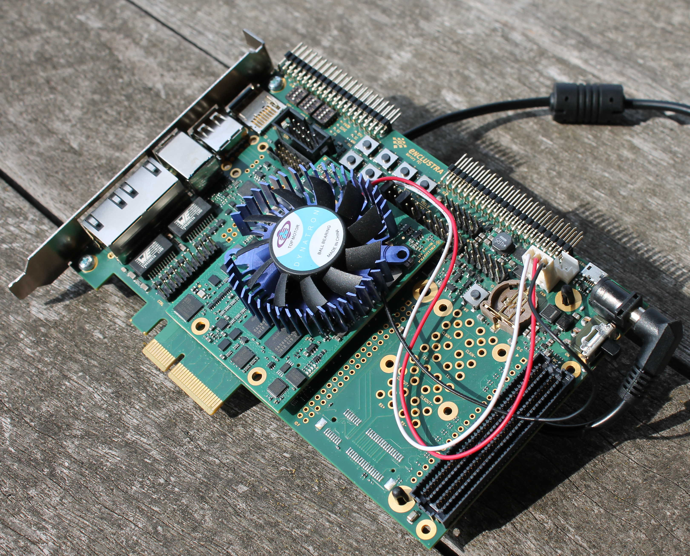
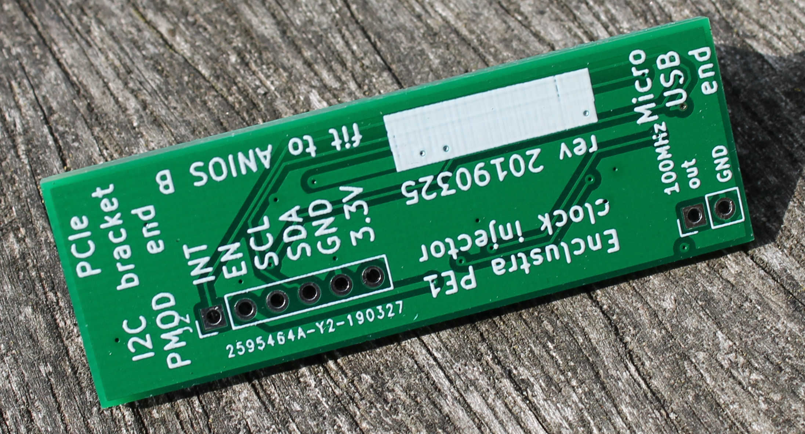
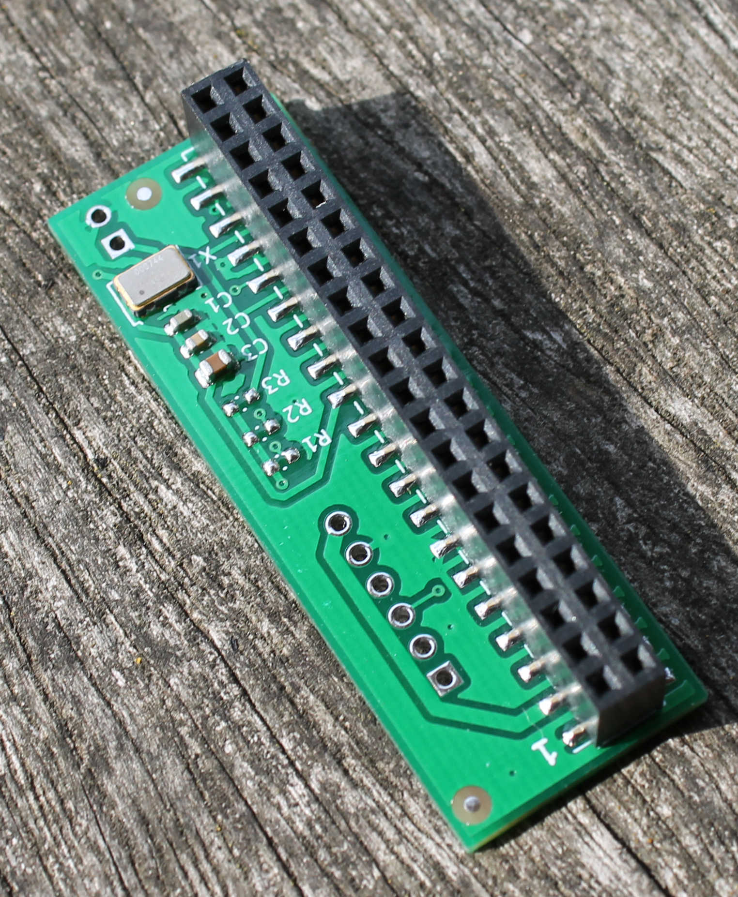
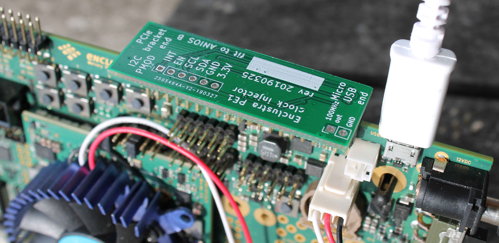
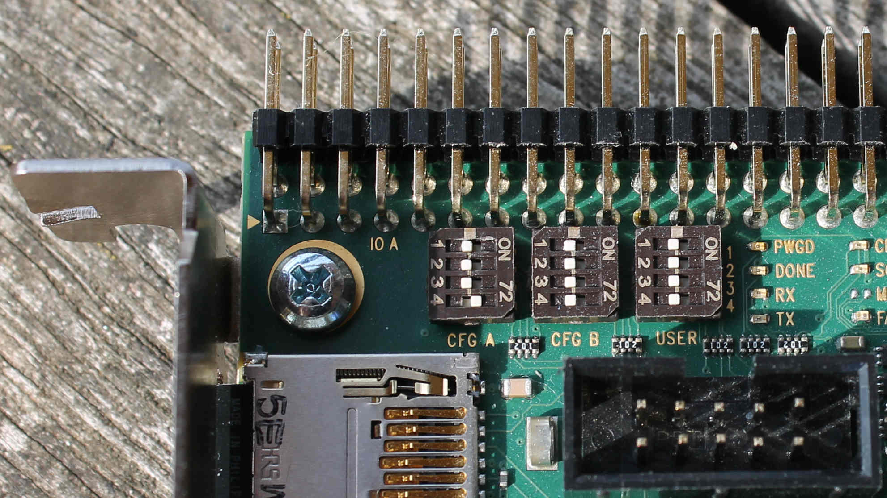
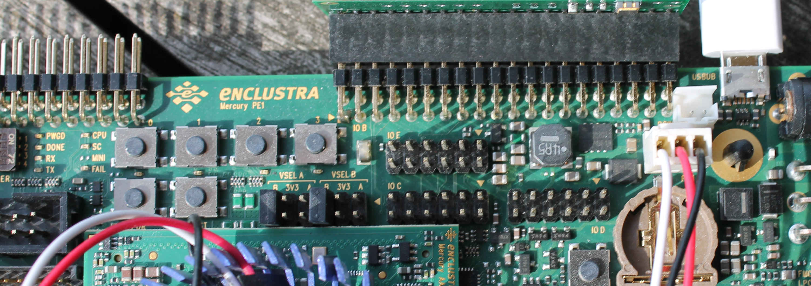

# Getting started with Thunderclap

This article describes how to get Thunderclap up and running on an FPGA.

## Shopping list



To use Thunderclap, the recommended shopping list is as follows:

* [Enclustra Mercury+ AA1 FPGA module with Arria 10 FPGA](https://www.enclustra.com/en/products/system-on-chip-modules/mercury-aa1/), part number 10AS027E4F29E3SG (€459).  If these are out of stock, the expanded temperature version 10AS027E2F29I2SG should also work but we haven't tried it.  The two 10AS048E2F29 modules (which have a more FPGA logic) should also work but will require minor changes to the FPGA project to target the different chip.
* [Enclustra Mercury+ PE1 base board for FPGA module](https://www.enclustra.com/en/products/base-boards/mercury-pe1-200-300-400/), part number ME-PE1-200-C (€275).  The more fully-featured PE1-300 and PE1-400 should also work - we won't make use of the extra features.
* Thunderclap PE1 clock injector module.  The PE1 does not generate a clock necessary to bring the PCIe transceivers up.  We designed ([GitHub repo](https://github.com/thunderclap-io/enclustra-pe1-clockinjector)) and manufactured a module to provide this clock.  A limited number of modules are available free of charge to users of Thunderclap - please email us with your shipping address to receive one.



* A 12V power supply with a 2.1mm DC barrel connector (inner 2.1mm, outer 5.5mm, centre positive), capable of at least 4 amps.  [Example from Adafruit](https://www.adafruit.com/product/352).  Note that there are a lot of poor quality power supplies on Amazon, eBay, etc - buy one that's UL approved from a reputable retailer.
* Slim cooling fan with heatsink, about 50-60mm, often described as a 'VGA cooler' or 'chipset cooler', with a 3 pin connector.  Examples include [Startech FANCSORB](https://www.startech.com/Computer-Parts/Fans/Aluminum-Universal-VGA-Cooler-Fan-with-Heatsink-and-TX3-Connector~FANCSORB), Evercool VGA cooler ([red](https://www.amazon.com/EVERCOOL-Mini-Universal-LED-Cooler/dp/B001E6OXFC), [blue](https://www.amazon.com/EVERCOOL-Mini-Universal-Cooler-Blue/dp/B001N0SGZM)), [Deepcool](https://www.amazon.com/Logisys-V50-Cooler-NVidia-Graphics/dp/B0087G0MY8/) and many others.
* If not supplied with your cooler, a thin double sided adhesive thermal pad at least 40x40mm to attach it to the FPGA chip.  Many available, such as [from Arctic](https://www.amazon.com/Arctic-4237-Efficient-Conductivity-Handling/dp/B00UYTTLI4/).  You can cut a larger piece down to size with scissors.
* For a Thunderbolt connections, a Thunderbolt 3 dock.  We've used the [Akitio Node](https://www.amazon.com/Akitio-Node-Thunderbolt3-Windows-Compatible/dp/B06XKKSNTS/).  If you wish to use it with MacOS, buy a dock that works with your version of MacOS for external GPUs - see [egpu.io](https://egpu.io/) for reviews.
* A MicroSD card 4GiB or larger.  We recommend Samsung or SanDisk cards for best performance (cards that [benchmark well](https://www.cameramemoryspeed.com/reviews/micro-sd-cards/) for random write IOPS are a good choice), but in principle any card should work.
* A micro USB cable
* Optional for PCIe tracing: a PCIe analyser.  We used a LeCroy CATC 10K chassis with PE801MA module, which is suitable for at least PCIe Gen1 x1 (as Thunderclap uses by default).  These are available for a few hundred dollars on eBay, although you also need the PCIe interposer card and cables which are often in separate listings.  PETracer 6.60 for Windows is the version of software we recommend.  Note that the licence for the PCIe functions (and number of lanes) is stored in the chassis, so it is risky buying module and chassis separately.
* Optional for Thunderclap FPGA debugging only: a [USB Blaster or USB Blaster II cable](https://www.terasic.com.tw/cgi-bin/page/archive.pl?Language=English&CategoryNo=74)
* A suitable place to work with antistatic precautions, for example [an antistatic wristband](https://www.amazon.com/Rosewill-Grounding-Alligator-RTK-002-Detachable/dp/B004N8ZQKY/) clipped to a metal pipe.

## Unboxing and hardware setup

1. Unpack your PE1 base board and AA1 module
2. Attach the AA1 module onto the base board, taking care to align the holes (it is possible to install it upside down which will damage the module) and then press it down to ensure the connectors fully engage
3. Cut a square of thermal pad to match the top of the large FPGA chip (it helps if you can keep the top of the chip free of fingerprints, or clean with a little isopropyl alcohol)
4. Press down the cooling fan onto the sticky thermal pad, taking care that metal parts do not touch any parts of the circuitry
5. Plug in the fan connector to the header on the PE1 board
6. Find the micro USB socket on the upper side of the board.  Attach the clock injector to the 40-way header next to the micro USB socket as depicted below.



7. Attach your micro USB cable to the socket, making sure it does not apply pressure on the clock injector board (a right angle connector may help avoid height issues in some cases)
8. Set jumpers and DIP switches as depicted below:




9. Mount the board in the PCIe slot of your PC or Thunderbolt dock
10. Attach the DC power cable to the socket on the top right of the board (don't connect it to the wall power at this time)
11. Set the slide switch next to the DC power connector to the 'down' position (you can use this switch to power on and off the board, although the switch won't turn off the board when the PCIe connector is active)
12. (Optionally) connect an ethernet cable to the upper of the two RJ45 ports on the PE1 card


# Software setup

For this you need a computer with a serial terminal program and a means to write disk images to SD cards via [Win32DiskImager](https://sourceforge.net/projects/win32diskimager/files/latest/download?source=navbar), dd or [balenaEtcher](https://www.balena.io/etcher/)

1. Download a Thunderclap Ubuntu SD card image

FIXME

2. Write the image to your micro SD card using a raw image writing tool.
3. Push the micro SD card into the slot on the PE1 board backplate (should click into place)
4. Attach your micro USB cable to your computer
5. Two serial ports should appear on your computer - you want the second one (eg /dev/ttyUSB1 on Linux, or /dev/tty.usbserial-FTENCB on macOS).  You may need to install [drivers from FTDI](https://www.ftdichip.com/FTDrivers.htm) on Windows.
6. Start your terminal program and configure the serial port (115200 baud, 8N1).  On Linux, `picocom -b 115200 /dev/ttyUSB1` opens a simple terminal (you may need to install picocom; press Ctrl-A then Ctrl-Q to exit it)
7. Apply power to your DC power supply.  You should see messages appear on your terminal:

```
U-Boot 2014.10 (Apr 03 2019 - 18:19:55), Build: jenkins-thunderclap-arria10-ubuntu-sdcard-master-42

CPU   : Altera SOCFPGA Arria 10 Platform
BOARD : Altera SOCFPGA Arria 10 Dev Kit
I2C:   ready
DRAM:  WARNING: Caches not enabled
SOCFPGA DWMMC: 0
FPGA: writing socfpga.rbf ...
FPGA: writing socfpga.rbf ...
Full Configuration Succeeded.
DDRCAL: Success
SDRAM: Initializing ECC 0x00000000 - 0x80000000
SDRAM-ECC: Initialized success with 4294 ms
INFO  : Skip relocation as SDRAM is non secure memory
Reserving 2048 Bytes for IRQ stack at: ffe386e8
DRAM  : 2 GiB
WARNING: Caches not enabled
MMC:   *** Warning - bad CRC, using default environment

In:    serial
Out:   serial
Err:   serial
Model: SOCFPGA Arria10 Dev Kit
Skipped ethaddr assignment due to invalid EMAC address in EEPROM
Net:   dwmac.ff800000
Error: dwmac.ff800000 address not set.

Hit any key to stop autoboot:  0
FPGA must be in Early Release mode to program core.
fpga - loadable FPGA image support

** Unable to read file u-boot.scr **
4874072 bytes read in 441 ms (10.5 MiB/s)
20009 bytes read in 6 ms (3.2 MiB/s)
FPGA BRIDGES: enable
Kernel image @ 0x008000 [ 0x000000 - 0x4a5f58 ]
## Flattened Device Tree blob at 00000100
   Booting using the fdt blob at 0x000100
   Loading Device Tree to 01ff8000, end 01fffe28 ... OK

Starting kernel ...

[    0.000000] Booting Linux on physical CPU 0x0
[    0.000000] Linux version 4.19.0-00114-ge3b47dd63c0f (root@thunderclap-build-images) (gcc version 7.2.1 20171011 (Linaro GCC 7.2-2017.11)) #1 SMP Wed Apr 3 18:12:09 UTC 2019
[    0.000000] CPU: ARMv7 Processor [414fc091] revision 1 (ARMv7), cr=10c5387d
[    0.000000] CPU: PIPT / VIPT nonaliasing data cache, VIPT aliasing instruction cache
[    0.000000] OF: fdt: Machine model: ALTR,system
```

and more messages as the Linux kernel boots.  Eventually you'll reach a login prompt:

```
[  OK  ] Started LSB: automatic crash report generation.
[  OK  ] Started Set console scheme.
[  OK  ] Started LSB: daemon to balance interrupts for SMP systems.
         Starting Authenticate and Authorize Users to Run Privileged Tasks...
[  OK  ] Started Apply the settings specified in cloud-config.

Ubuntu 16.04.4 LTS arria10 ttyS0

First login username 'ubuntu', password 'ubuntu', sudo available

arria10 login:
```

As described, the login user is 'ubuntu' and the first-time login password is 'ubuntu' - you will be prompted to change it on your first login.

You are now logged into a more-or-less standard Ubuntu 16.04 ARMv7 system, so all the features of a headless Ubuntu system (similar to a Raspberry Pi and other boards) are available.  For instance networking, USB mass storage, package installation, SSH, etc.

# Running the Thunderclap device model

A basic version of the Thunderclap device model is provided on the SD card image.  To do this, run

```
sudo /root/thunderclap
```

Some debugging information will be printed, such as:

```
INIT PAGE LIST
Starting.
PCIe Core Drained. Let's go.
Starting packet processing coroutine.
~~~~~~~~~~ Init client.
~~~~ Init default.
Setting device nic_id...
!!!!!!  Realising e1000e!
qemu_new_nic called.
Creating new nic with 1 queues.
WARNING: e1000e: Device requires 2 network backend queues for optimal performance. Current number of queues is 1.
Init done. Let's go.
```

At this point we're ready to hotplug the Thunderclap platform into our target.  We won't see more messages on the console (Thunderclap stays quiet so as to respond to PCIe messages in a timely manner), but if you boot a PCIe PC or plug in to a Thunderbolt port you should see an Intel ethernet controller appear.  This is Thunderclap in operation.

FIXME
