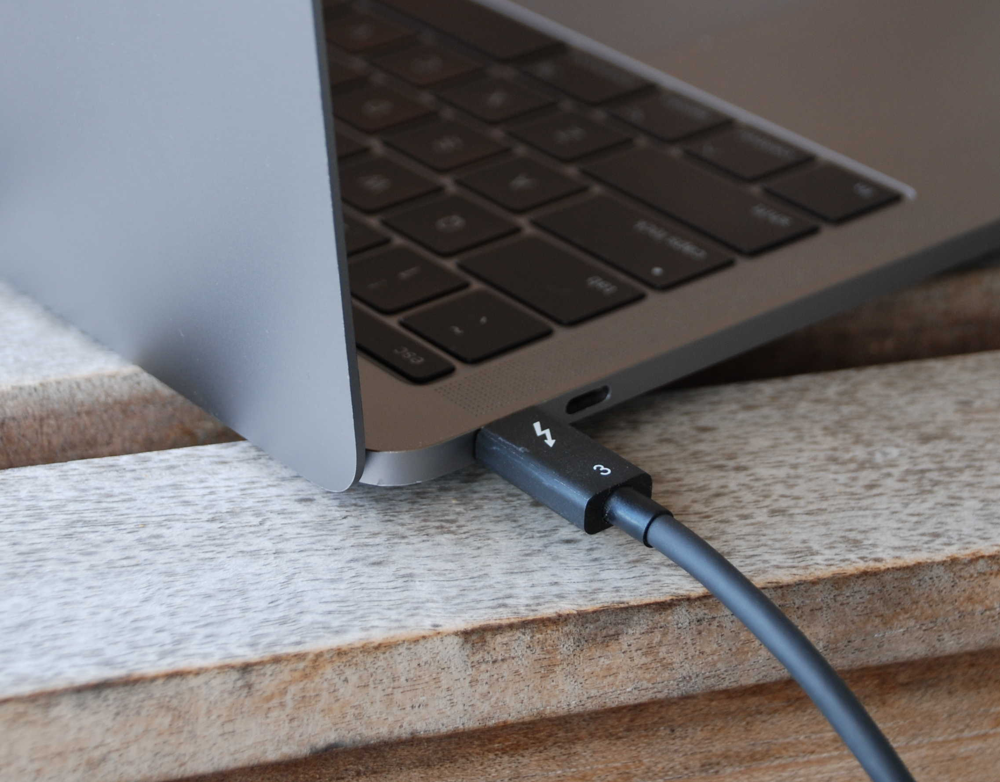
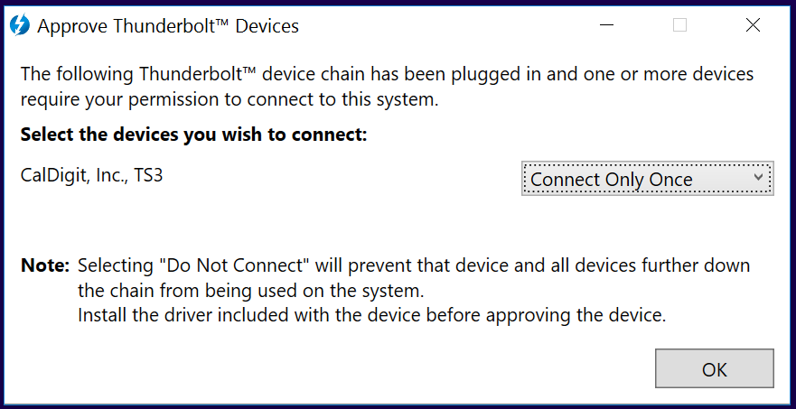

# Modern computers are vulnerable to malicious peripheral devices

## Contents

- [About the Thunderclap vulnerabilities](#modern-computers-are-vulnerable-to-malicious-peripheral-devices)
  * [FAQ](#faq)
- [Technical details of the Thunderclap platform](#technical-details-of-the-thunderclap-platform)
    + [Mailing list](#mailing-list)

## About the Thunderclap vulnerabiltiies

The Thunderclap vulnerabilities are security flaws that affect the way modern computers interact with peripheral devices such as network cards, storage, and graphics cards. These vulnerabilities allow an attacker with physical access to a Thunderbolt port to compromise a target machine in a matter of seconds, running arbitrary code at the highest privilege level and potentially gaining access to passwords, banking logins, encryption keys, private files, browsing and other data. Attacks exploiting these vulnerabilities can also be carried out by seemingly innocuous peripherals like chargers and projectors that correctly charge or project video but simultaneously compromise the host machine.

The Thunderclap platform is a hardware/software stack for research into the security of computer peripherals and their interaction with operating systems. It was used to discover the Thunderclap vulnerabilities and develop proof-of-concept exploits.

 
([photos available under a Creative Commons Attribution license](https://github.com/thunderclap-io/thunderclap-io.github.io/tree/master/photos))

The Thunderclap platform as well as a number of Thunderclap vulnerabilities and proof-of-concept attacks are described in:

**[Thunderclap: Exploring Vulnerabilities in Operating System IOMMU Protection via DMA from Untrustworthy Peripherals](thunderclap-paper-ndss2019.pdf)** A. Theodore Markettos, Colin Rothwell, Brett F. Gutstein, Allison Pearce, Peter G. Neumann, Simon W. Moore, Robert N. M. Watson. _Proceedings of the [Network and Distributed Systems Security Symposium (NDSS)](https://www.ndss-symposium.org/ndss2019/)_, 24-27 February 2019, San Diego, USA. [BibTeX](thunderclap-paper-ndss2019.bib)

More information about some of the experiments can be found in the following PhD thesis:

**[Exploitation from malicious PCI Express peripherals](https://www.cl.cam.ac.uk/techreports/UCAM-CL-TR-934.html)** Colin Rothwell. University of Cambridge Computer Laboratory technical report UCAM-CL-TR-934.

The Thunderclap platform is open-source and available for researchers to build or extend:

[https://github.com/thunderclap-io](https://github.com/thunderclap-io)

## FAQ

### Who is affected by the Thunderclap vulnerabilities?

Thunderclap vulnerabilities affect computers with Thunderbolt ports running Windows, macOS, Linux, and FreeBSD. Many modern laptops and an increasing number of desktops are susceptible.

Thunderbolt 3 is often supported via USB Type-C ports on modern laptops. Machines with older versions of Thunderbolt (carried over a Mini DisplayPort connector) are also affected.

In particular, all Apple laptops and desktops produced since 2011 are vulnerable, with the exception of the 12-inch MacBook. Many laptops, and some desktops, designed to run Windows or Linux produced since 2016 are also affected - check whether your laptop supports Thunderbolt.

Thunderclap vulnerabilities can also be exploited by compromised PCI Express peripherals, either plug-in cards or chips soldered to the motherboard.

### How can I protect myself?

The novel threat model introduced by the Thunderclap platform, as well as specific attacks described in our paper, have been disclosed to major hardware and operating system vendors.  Vendors have shipped substantial mitigations to address them (described below), and it is important that users install security updates for their operating systems to be protected.

More generally, however, we have discovered a larger vulnerability space that is not fully addressed by mitigations for specific attacks.  The best way to fully protect yourself is to disable the Thunderbolt ports on your machine. However, the need to charge and connect legitimate peripheral devices makes doing so infeasible in general. PCs often allow disabling Thunderbolt in firmware (BIOS/UEFI) settings, while permitting power, video and USB.  Externally, a USB hub/docking station without Thunderbolt support should suffice to prevent a USB-C port being switched into Thunderbolt mode.

You can also protect yourself by not leaving your computer unattended in public and not using public USB-C charging stations. Be wary of connecting an unknown device to the Thunderbolt port of your machine, even chargers and projectors that may seem harmless.

In the case of Windows, a prompt may appear when a new Thunderbolt device is attached - you should only approve this when the device is one you trust, and for which you explicitly need to enable Thunderbolt features (not just video or charging).  If you are prompted unexpectedly, you should not agree to any prompts, in particular with regard to installing drivers, and should unplug and not use the device.

### How do the Thunderclap vulnerabilities work?

The Thunderclap vulnerabilities stem from the fact that computer peripherals such as network cards and GPUs have traditionally been trusted parts of a computer system: they have direct memory access (DMA), which allows them to read and write all of system memory without operating system oversight. DMA allows peripherals to bypass operating system security policies, and DMA attacks abusing this access have been widely employed by hackers and the intelligence community to take control of and exfiltrate sensitive data from target machines.  This means passwords, banking logins, private files and browser activity are all exposed, and an attacker can inject any code they wish onto your machine.

Current systems feature input-output memory management units (IOMMUs), protection mechanisms that allow the operating system to restrict peripheral-device memory access. With IOMMU usage enabled, operating systems can protect against DMA attacks by restricting memory access to peripherals that perform legitimate functions and only allowing access to non-sensitive regions of memory.  Unfortunately, IOMMU protection is turned off by default in many systems.

Our work leverages vulnerabilities in operating system IOMMU usage to compromise a target system via DMA, even in the presence of an IOMMU that is enabled and configured to defend against DMA attacks. The novel Thunderclap security evaluation platform, built on field-programmable gate array (FPGA) hardware, mimics the functionality of a legitimate peripheral device to convince a target operating system to grant it access to regions of memory. It then examines those regions of memory to find a rich and nuanced attack surface of vulnerable structures that can be exploited to take control of the system.

The rise of hardware interconnects like Thunderbolt 3 over USB-C that combine power input, video output, and peripheral device DMA over the same port greatly increases the real-world applicability of Thunderclap vulnerabilities. Thunderbolt can allow potentially malicious devices to hotplug into a running machine and obtain direct memory access, which makes DMA attacks against temporarily unattended targets feasible. Furthermore, the confusion of power, video, and DMA facilitates the creation of malicious charging stations or projectors that take control of connected machines.

Additionally, our work shows that the Thunderclap vulnerabilities can also be exploited by compromised firmware on existing PCI Express devices, for example network cards or baseboard management controllers (BMCs) integrated into servers.  A firmware compromise might be introduced via a firmware vulnerability or a compromise in the device supply chain or factory.

### What is DMA?

Direct memory access (DMA) is a technique by which peripheral devices can read and write computer memory on their own, without a software operating system performing or governing the access.  It makes transferring data much more efficient in terms of time and power, and is vital to enabling high-performance peripherals, like network cards and GPUs.

### What is an IOMMU?

The input-output memory management unit (IOMMU) is a protection mechanism that allows the operating system to restrict peripheral device memory access. It works similarly to the memory management unit (MMU), which allows the operating system to manipulate the memory accesses of running programs. With IOMMU usage enabled, the operating system controls which peripheral devices can access memory and which regions of memory they can access.

### Why don't IOMMUs provide protection in current systems?

Existing strategies for using the IOMMU to protect against DMA attacks come with a high performance cost. This cost has led current operating systems to trade off security for performance gains - in some cases even disabling the IOMMU by default. Current operating systems also put sensitive data in the same regions of memory used for peripheral device communication, which facilitates attacks even when the IOMMU is enabled.

### What is Thunderbolt access control and why doesn't it address these problems?

Thunderbolt access control is a mechanism by which Windows and some Linux systems can prompt the user when a device is connected and allow the user to decide whether to block the device, to allow it once, or to allow and remember for next time.

We don't break Thunderbolt access control; the Thunderclap vulnerabilities are orthogonal to it and are more fundamental.  However we also believe Thunderbolt access control is insufficient in a number of respects.

First, MacOS does not implement access control prompts; it contains a whitelist of approved Thunderbolt devices that are automatically permitted.  This means it's simply necessary for an attacker to purchase an approved Thunderbolt dock and access is granted.

Second, when given an all-or-nothing prompt (approve or deny), users are habituated to clicking 'accept'.  In particular, since the prompt does not give sufficient indication of what access the device is requesting, users cannot make an informed judgement about whether to allow it.  For example, above an attacker can simply label their device as a 'CalDigit TS3' to lull users into a false sense of security.

Additionally, Thunderbolt access control only covers the Thunderbolt layer.  Our work relates to devices that sit on top of Thunderbolt, which talk via PCI Express (by analogy, Thunderbolt is the telephone wiring and PCI Express is the language spoken by someone on the telephone). Previous work has shown it's possible to swap out a PCI Express device for another without causing Thunderbolt authentication to notice that the device internals have been replaced.  This means an attacker can buy a genuine device and make substantial modifications to it without Thunderbolt being aware that anything is different about it.

That said, if you receive a Thunderbolt prompt when connecting a device which you believe is only a charger or display, you should not approve it.

PCI Express itself has no access control of this kind, so this mechanism does not protect desktops and servers from their PCIe cards.

### How does this work differ from earlier DMA attacks such as [Inception](https://github.com/carmaa/inception)?

Early DMA attacks relied on the absence of an IOMMU. They involved scanning all of a system’s memory for sensitive data from devices that did not appear to the system as legitimate peripherals. These attacks were addressed by the introduction of IOMMUs, which block all memory access from unrecognized devices.

Some previous DMA attacks have taken advantage of weaknesses in IOMMU configuration or setup to disable IOMMU protections. Thunderclap explores serious vulnerabilities that are present even once the IOMMU is configured correctly.

### How does this work differ from attack techniques such as [Facedancer](https://www.cs.dartmouth.edu/~sergey/usb/) and [BadUSB](https://opensource.srlabs.de/projects/badusb)?

Thunderclap explores a different vulnerability space.  USB is a message-based protocol; devices pass messages which are interpreted by software at each end.  Facedancer- and BadUSB-style attacks provide malformed or illegitimate messages, with the aim of confusing or compromising driver software running on the host computer.

Thunderclap uses DMA, a lower-level technique which allows much more privileged access to the internal state of the computer than USB.  In systems that don't use an IOMMU, it exposes 100% of the data in the computer’s memory.

### How did vendors respond to these vulnerabilities?

We disclosed these vulnerabilities to vendors in 2016 and have worked with them as they developed fixes.

In MacOS 10.12.4 and later, Apple addressed the specific network card vulnerability we used to achieve a root shell.  However the general scope of our work still applies; in particular that Thunderbolt devices have access to all network traffic and sometimes keystrokes and framebuffer data.

Microsoft have enabled support for the IOMMU for Thunderbolt devices in Windows 10 version 1803, which shipped in 2018. Earlier hardware upgraded to 1803 requires a firmware update from the vendor.  This brings them into line with the baseline for our work, however the more complex vulnerabilities we describe remain relevant.

Recently, Intel have contributed patches to version 5.0 of the Linux kernel (shortly to be released) that enable the IOMMU for Thunderbolt and prevent the protection-bypass vulnerability that uses the ATS feature of PCI Express.

The FreeBSD Project indicated that malicious peripheral devices are not currently within their threat model for security response. However, FreeBSD does not currently support Thunderbolt hotplugging.

In general terms, platforms remain insufficiently defended from peripheral devices over Thunderbolt such that users should not connect devices they do not know the provenance of or do not trust.

One major vendor of notebook computers stated they they would want to understand how to address these vulnerabilities before adding Thunderbolt to new product lines.

### Why have you open-sourced the Thunderclap platform? Won't that just help attackers?

We've open-sourced our platform to aid others in performing security evaluation of their products and to stimulate security research in this area.
A number of companies have told us they would like to evaluate their products' resilience to DMA attacks but lack the skills and resources to build such an evaluation platform.
Using the Thunderclap platform requires investment in hardware and a high degree of technical skill, so it is not straightforward to use for attackers.

We have also performed development of proof-of-concept hardware platforms where Thunderclap could run, for example an implant in a Thunderbolt dock, but we have chosen not to release them at this time.

## Technical details of the Thunderclap platform

The Thunderclap platform consists of an FPGA that runs the Thunderclap application.  The FPGA then plugs into a computer via PCI Express or Thunderbolt.  The Thunderclap application makes the FPGA behave to the computer like a genuine Ethernet card (the Intel 82574L network interface card or NIC).  The operating system will identify the ethernet peripheral, load drivers, allow the device to access memory (via DMA and an IOMMU if enabled), and ask it to send and receive packets.

With this deep interaction with the operating system, Thunderclap's device model provides hooks that allow payload functions to be added to device behavior.  For example, when the operating system asks the NIC to send a packet, it provides the NIC with the address of the data to send.  A payload function might search nearby memory looking for plaintext data that was intended for a different network device.

The Thunderclap application runs on Intel/Altera FPGA boards:

* [Intel Arria 10 SoC Development Kit](https://www.intel.com/content/www/us/en/programmable/products/boards_and_kits/dev-kits/altera/arria-10-soc-development-kit.html) ($4500) with Samtec HDR-181157-01-PCIEC cable (available from Samtec direct) - **currently recommended**
* [Enclustra Mercury+ AA1](https://www.enclustra.com/en/products/system-on-chip-modules/mercury-aa1/) module (ME-AA1-270-3E4-D11E) on [PE1](https://www.enclustra.com/en/products/base-boards/mercury-pe1-200-300-400/) carrier board (~EUR 800) - **work in progress**
* Terasic DE5-Net board (Stratix V) with BERI soft-CPU - **no longer supported**
* As far as we can ascertain, Xilinx, Lattice and Intel Cyclone FPGAs don't allow us to replace the vendor-supplied implementation of configuration registers with our own (Intel calls it 'config bypass' mode) which we require.

It is composed of several pieces:

* The underlying FPGA bitfile, containing the hardware that receives PCIe packets (TLPs) and delivers them to software.  The FPGA contains an Arm Cortex A9 CPU (hard processor system or HPS) to run our software stack. [GitHub repo](https://github.com/thunderclap-io/thunderclap-fpga-arria10)
* The Ubuntu 16.04 operating system running on the on the Arm, including kernel, device tree and u-boot bootloader (which also loads the FPGA bitfile at boot time). Automated build scripts (work in progress): [GitHub repo](https://github.com/thunderclap-io/thunderclap-ubuntu-sdcard)
* The Thunderclap application, which is a substantially cut down version of QEMU, based on its `e1000e` device.  This runs in Ubuntu on the ARM core and connects directly to the PCIe queues provided by the hardware. [GitHub repo](https://github.com/thunderclap-io/thunderclap-qemu)

### Mailing list

The [cl-thunderclap-users mailing list](https://lists.cam.ac.uk/mailman/listinfo/cl-thunderclap-users) exists for users of the Thunderclap hardware/software platform.
